# ZeroEngine

Renderer based on DX12 from zero.

## Credits

- [TheCherno/Hazel: Hazel Engine (github.com)](https://github.com/TheCherno/Hazel)
- [hebohang/HEngine: HEngine - 2D/3D Game Engine written in C++20 (github.com)](https://github.com/hebohang/HEngine)
- [jpvanoosten/LearningDirectX12: This repository is intended to be used as a code repository for learning DirectX 12. (github.com)](https://github.com/jpvanoosten/LearningDirectX12)
- [SuikaSibyl/SibylEngine2021 (github.com)](https://github.com/SuikaSibyl/SibylEngine2021)
- [zhanjinzhao/TotoroEngine: A toy 3D game engine using DirectX 12. (github.com)](https://github.com/zhanjinzhao/TotoroEngine)
- [mateeeeeee/Adria-DX12: Rendergraph-based graphics engine written in C++ using DirectX12 (github.com)](https://github.com/mateeeeeee/Adria-DX12)

## MileStone

### ClearValue **2022-08-23**

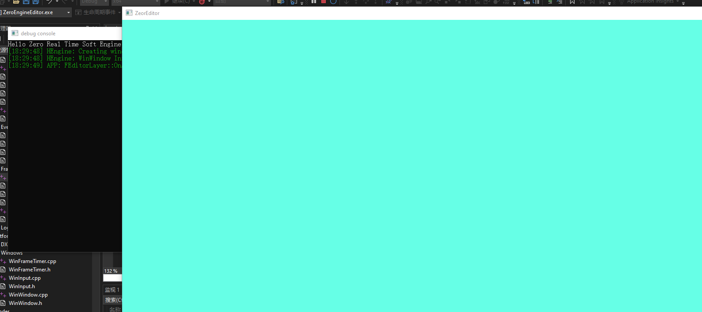

### Hello Triangle **2022-09-14**

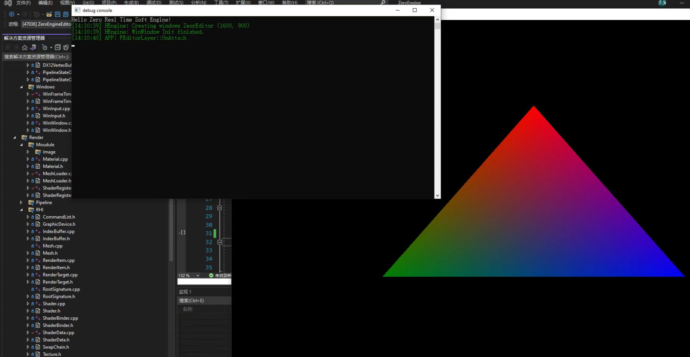

### Hello Texture Box  **2022-09-19**

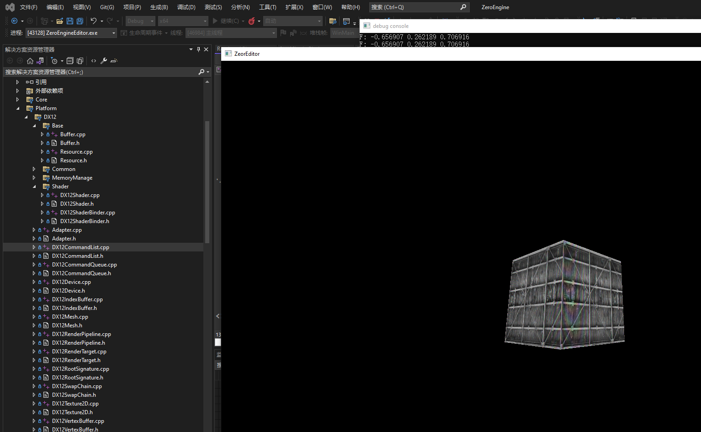

### Hello imgui  **2022-09-22**

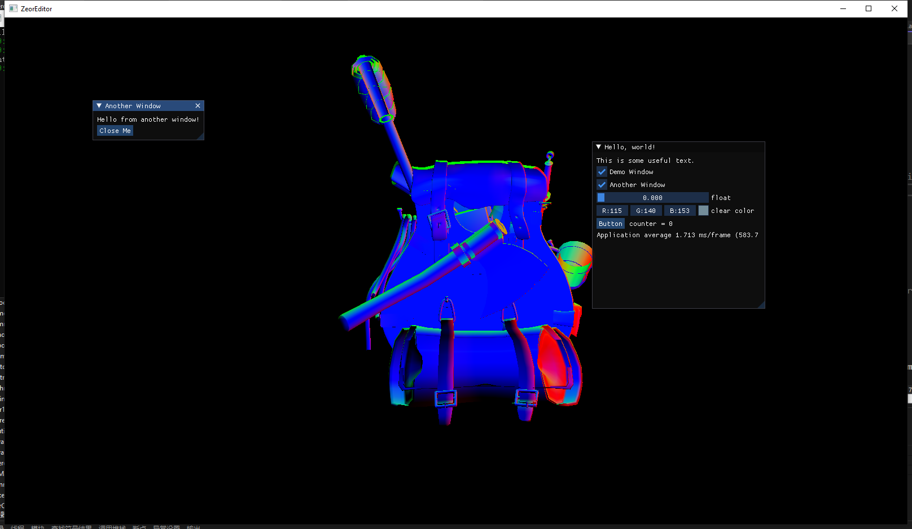

### Editor framework based imgui & ImGuizmo &  Code Reflection **2022-10-23**

you can modify the objects' properties through DetailPanel  based code reflection (**reference to UE4**)

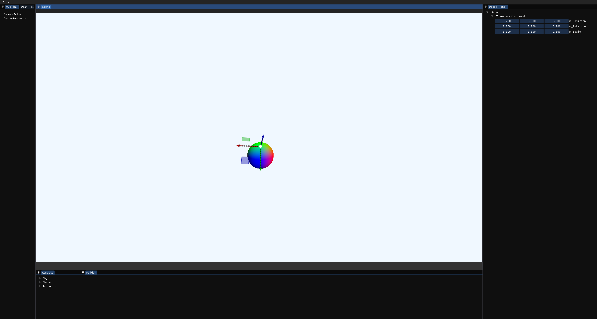

### Save scene based dode reflection (using yaml) **2022-10-31**

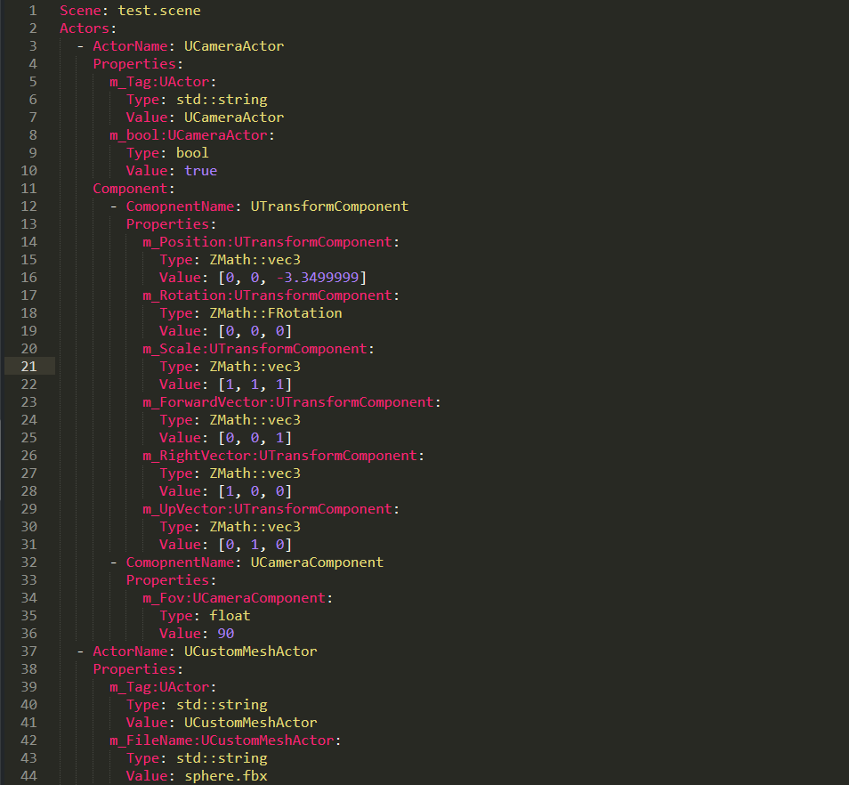

### **DirectLight Control 2022-11-5**

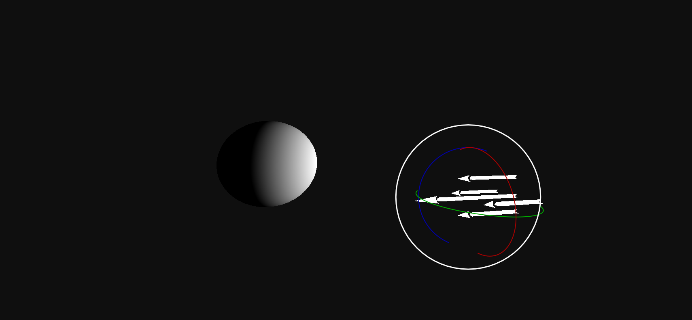

### Simple Material System 2022-11-17

I converted the map and vector data to UI panel through code reflection.

You can DIY the slide floats, colos, and textures in the material file, attaching these parameters to the shader and preparing the comming PBR effect in the future!

 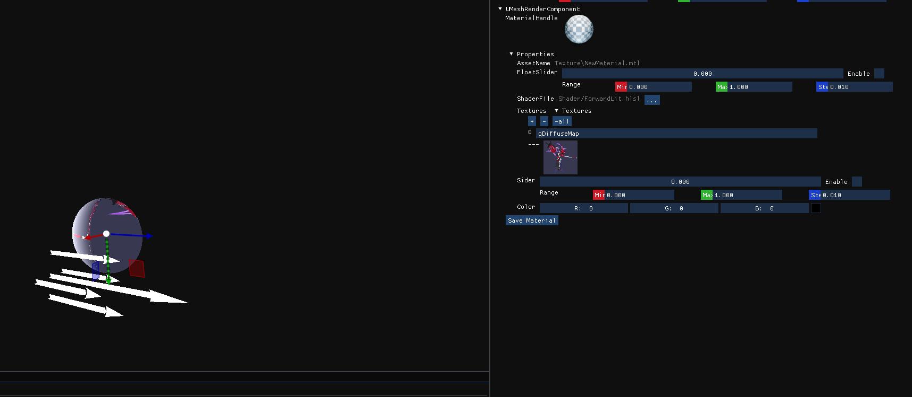

### Skybox 2022-11-27

I've disjoined shader and PSO into 2 parts. So we can config PSO settings, such as cull mode, depth compair func, blend state, etc.

Absolutely the skybox need different PSO, DepthFunc is LESS_EQUAL, CullMode is CULL_MODE_FRONT.

```cpp
FPSODescriptor SkyboxPSODesc;
SkyboxPSODesc.CullMode = ECullMode::CULL_MODE_FRONT;
SkyboxPSODesc.DepthFunc = EComparisonFunc::LESS_EQUAL;
SkyboxPSODesc.Shader = FRenderer::GraphicFactroy->CreateShader("Shader/Skybox.hlsl", ShaderBinderDesc, ShaderDessc);
FRenderer::GraphicFactroy->CreatePSO(PSO_SKYBOX, SkyboxPSODesc);
```

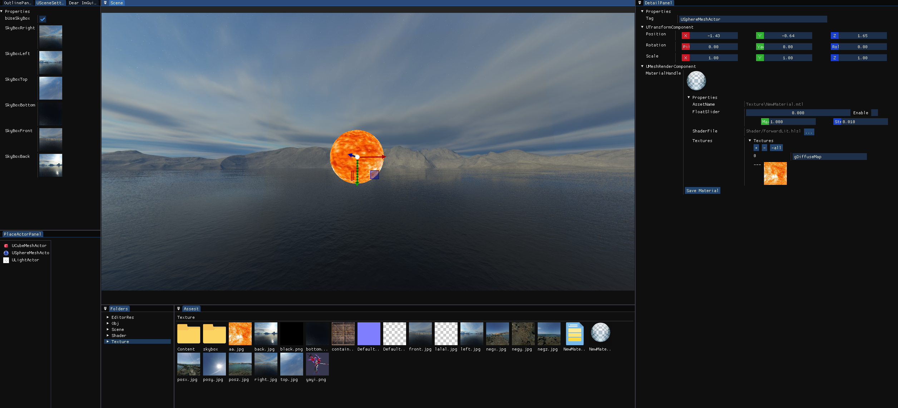

### Shader Code Reflecion 2022-12-9

I just used **ID3D12ShaderReflection** to get shader code layout

```cpp
ID3D12ShaderReflection* Reflection = nullptr;
D3DReflect(PassBlob->GetBufferPointer(), PassBlob->GetBufferSize(), IID_ID3D12ShaderReflection, (void**)&Reflection);

D3D12_SHADER_DESC D3DShaderDesc;
Reflection->GetDesc(&D3DShaderDesc);
```

After getting the buffer and resource layout, take these info to cpp, and make these reflected to UI panel through code reflection in cpp. So we can edit the parameters easily.

| Shader Code                                                                                        | UI                                             |
| -------------------------------------------------------------------------------------------------- | ---------------------------------------------- |
| 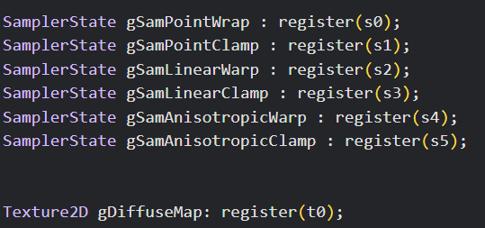<br />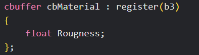 | 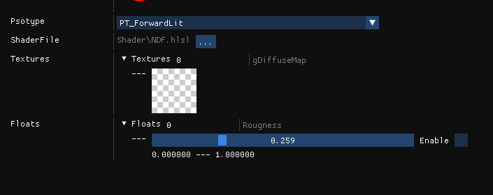 |

### Image-based Lighting (IBL) 2022-12-27

The framework, the code reflction, the UI design, all of these above are just for this !

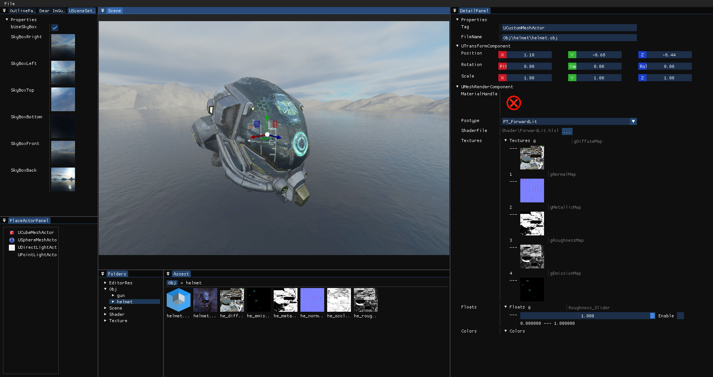

### ShadowMap  2023-1-2

I am gonna do research on several shadow algorithms. PCF, PCSS, CSM, VSM etc.

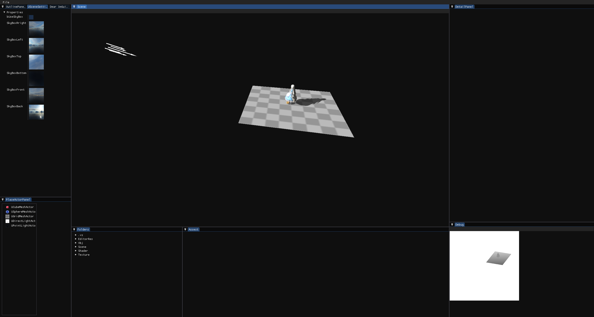

### Framework code restructure 2023-3-11

I stopped developping new features for a long while to restruct the framework.

Actually I've added some cool features to my renderder.

- Resource managerment based Buddy System.  I managed the resources including textures, upload buffers, default buffers etc.
- Generate Mips for textures through compute shader. It is such a best way to learn how to use CS!
- Shader hot fix through dxc. Maybe there are  some bugs.

Frame Graph is on the way !


### Frame Graph framework 2023-4-16

Since the code was not so complicated, I upgraded the render framework. It is the brand new render pipeline that is totally different from former. 

light, shadow, light effects will be transform to the frame graph as render passes.
